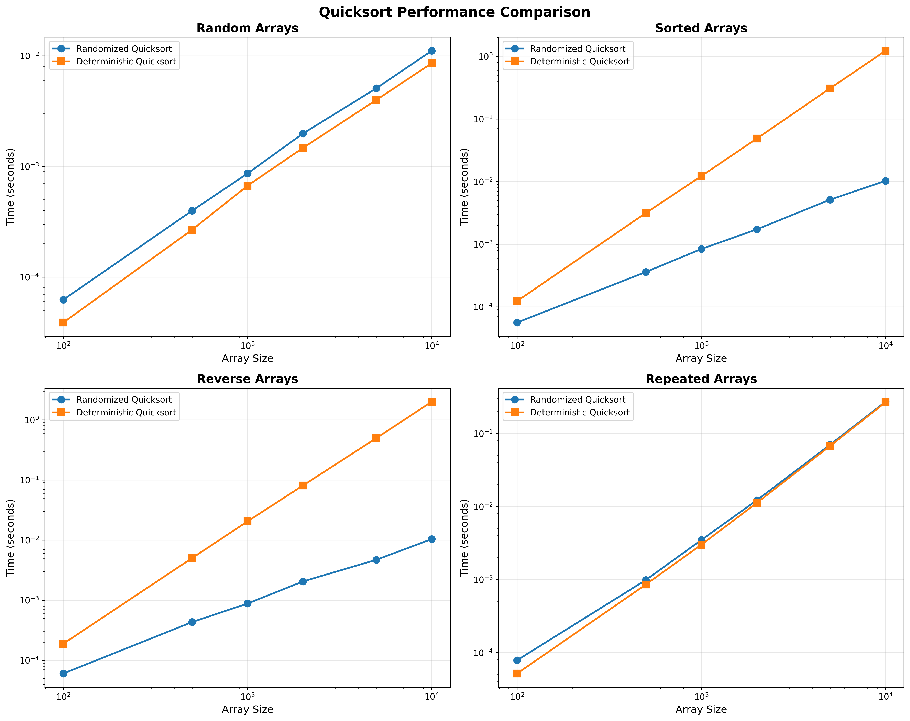
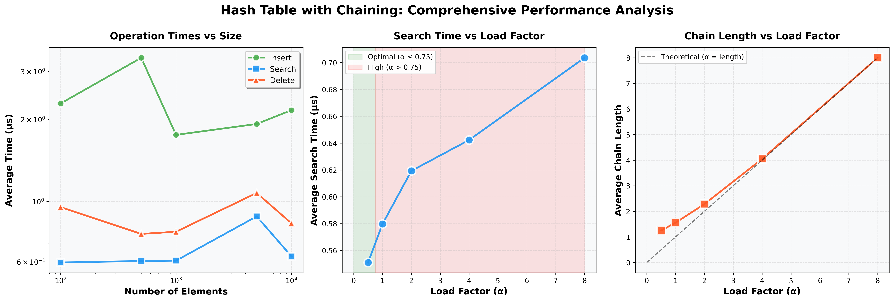

# Assignment 3: Understanding Algorithm Efficiency and Scalability

## Part 1: Randomized Quicksort Analysis

### Implementation
Let's see the main function of quicksort

```python
def randomized_quicksort(arr, left, right) -> List[int]:
   ...
   if left < right:
      # First Step: Partition
      # use the index to partition the array
      pivot_index = randomized_partition(arr, left, right)

      # Second Step: Recursive Sorting for the Left Part
      # quicksort from the left to the pivot index - 1
      randomized_quicksort(arr, left, pivot_index - 1)

      # Third Step: Recursive Sorting for the Right Part
      # quicksort from the pivot index + 1 to the right
      randomized_quicksort(arr, pivot_index + 1, right)
```

And witin the partision, 
```python
def partition(arr, left, right) -> int:
   pivot = arr[right]
   i = left - 1
   
   # This is used for placing the pivot. 
   # All the elements smaller than the pivot is moved to its left. 
   # All the elements greater than the pivot is moved to its right.
   for j in range(left, right):
      if arr[j] <= pivot:
         i += 1
         arr[i], arr[j] = arr[j], arr[i]
   
   arr[i + 1], arr[right] = arr[right], arr[i + 1]
   return i + 1
```

### Theoretical Analysis

#### Average-Case Time Complexity: O(n log n)

**Proof using Indicator Random Variables:**

Let X be the total number of comparisons made by Randomized Quicksort on an array of n elements.

For elements z_i and z_j (where i < j), define indicator random variable:
```
X_ij = I{z_i is compared to z_j}
```

The total number of comparisons is:
```
X = Σ Σ X_ij  (for all i < j)
```

Taking expectations:
```
E[X] = Σ Σ E[X_ij] = Σ Σ Pr{z_i is compared to z_j}
```

**Key Insight**: Elements z_i and z_j are compared if and only if one of them is chosen as a pivot before any element between them.

Consider the set Z_ij = {z_i, z_{i+1}, ..., z_j} containing (j - i + 1) elements.

The probability that z_i or z_j is chosen first as pivot from Z_ij is:
```
Pr{z_i is compared to z_j} = 2/(j - i + 1)
```

This is because:
- Any element in Z_ij is equally likely to be chosen first
- Only if z_i or z_j is chosen first will they be compared
- There are (j - i + 1) elements total, and 2 favorable outcomes

Therefore:
```
E[X] = Σ_{i=1}^{n-1} Σ_{j=i+1}^{n} 2/(j - i + 1)
```

Let k = j - i:
```
E[X] = Σ_{i=1}^{n-1} Σ_{k=1}^{n-i} 2/(k + 1)
     < Σ_{i=1}^{n-1} Σ_{k=1}^{n} 2/k
     = Σ_{i=1}^{n-1} 2(ln n + O(1))
     = O(n log n)
```

**Conclusion**: Given that the possibility of choosing each element as a pivot is equal, it give us balanced partitions on average. A balanced partitions mean the recursive path is not skew, which give us O(n log n) Time Complexity. No specific input can consistently cause bad performance


### Empirical Comparison

#### Test Methodology:
- Array sizes: 100, 500, 1000, 2000, 5000, 10000
- Four data distributions:
  - **Random**: Uniformly distributed random integers
  - **Sorted**: Already sorted in ascending order
  - **Reverse**: Sorted in descending order
  - **Repeated**: Many duplicate values (high repetition)
- Each test averaged over 5 trials
- Comparison between Randomized and Deterministic Quicksort

#### Results:

We could see from the picture that Deterministic QuickSort suffer from sorted data, no matter it is reversed or not. That being said, even it is already sorted data, it still need O(n^2) to check it. Overall, random number selection cause some overheads, but it is worthwhile for guaranteed good average-case performance

---

## Part 2: Hashing with Chaining

### Implementation

The Hash Table implementation includes:

1. **Chaining for Collision Resolution**: Each slot contains a linked list of key-value pairs
```python
# create a new node with key value
new_node = Node(key, value)
# insert the new (collision) node at the first place of link list
new_node.next = self.table[index]
# Store linked list into table
self.table[index] = new_node

```
2. **Universal Hash Function**: Uses the family h(k) = ((a·k + b) mod p) mod m
```python
# p(prime) is a prime number larger than universe size
self.prime = 2147483647
# a and b were chosen randomly
self.a = random.randint(1, self.prime - 1)
self.b = random.randint(0, self.prime - 1)
```
3. **Dynamic Resizing**: Automatically doubles capacity when load factor exceeds threshold (0.75)
```python
def _resize(self) -> None:
   old_table = self.table
   # Doubles the capacity
   self.capacity *= 2
   self.table = [None] * self.capacity
   self.size = 0

   # Rehash all elements
   for node in old_table:
      current = node
      while current is not None:
         # re-insert the key value to maintain hash table
         self.insert(current.key, current.value)
         current = current.next
```

### Theoretical Analysis

#### Assumptions:
1. **Simple Uniform Hashing**: Each key is equally likely to hash to any slot
2. **Independent Hash Values**: Hash values are independent across keys
3. **Universal Hash Function**: Chosen from universal family to minimize collisions

#### Expected Time Complexity:

If we equally distribute all the elements to the slots, the average number of elements per slot is `α = n/m`. This value is also **Load Factor**, which tell us the approximate length of the chain `α`

So every time we operate the key value pair, we spend Θ(1) to find the slot. And since α is the expected number of elements in the slot, it take us Θ(1 + α) time to search/update/delete


#### Load Factor Impact:

| Load Factor (α) | Expected Operations | Performance |
|----------------|---------------------|-------------|
| α < 0.5        | O(1) - O(1.5)      | Excellent   |
| α ≈ 0.75       | O(1.75)            | Good        |
| α ≈ 1.0        | O(2)               | Acceptable  |
| α > 2.0        | O(2+)              | Poor        |

#### Universal Hashing
- Minimizes collision probability
- For any two keys k₁ ≠ k₂:
  ```
  Pr{h(k₁) = h(k₂)} ≤ 1/m
  ```
- Better than simple hash functions

#### Collision Minimization Strategies:


### Alternative Collision Resolution
There are some ways to avoid collision. One way is like our implementation, we use Linked List to solve collision. Another way to avoid it is through Double Hashing, which basically hash twice and potentially find unoccupied slot to store. There are still some techniques, such as Probing sequences or Multiple hash functions. 

#### Results

We could see from the picture that size doesn't affect the average operation time. Although it has some rise and fall, the time complexity is near constant. 


## Conclusions
As we discussed in Assignment2, Time Complexity of Quick Sort is close to O(n log n), but it is highly affected by the type of data. By implementing Randomized Quicksort, we could have more robustness with minimal overhead. 

However, if we frequently insert and delete the data, we might want to use Hash Table with Chaining. Because it provides us Θ(1 + α) time complexity no matter it is insert, update and delete operation. 

To maintain high efficiency in Hashing, we would want to keep load factor α lower than 0.75. Besides, we could implement dynamic resizing to handle growing datasets so that capacity(size of hash table) could be adjusted based on workload and maintain the efficiency. 

---

## References

1. Cormen, T. H., Leiserson, C. E., Rivest, R. L., & Stein, C. (2009). *Introduction to Algorithms* (3rd ed.). MIT Press.
2. Sedgewick, R., & Wayne, K. (2011). *Algorithms* (4th ed.). Addison-Wesley.
3. Knuth, D. E. (1998). *The Art of Computer Programming, Volume 3: Sorting and Searching* (2nd ed.). Addison-Wesley.