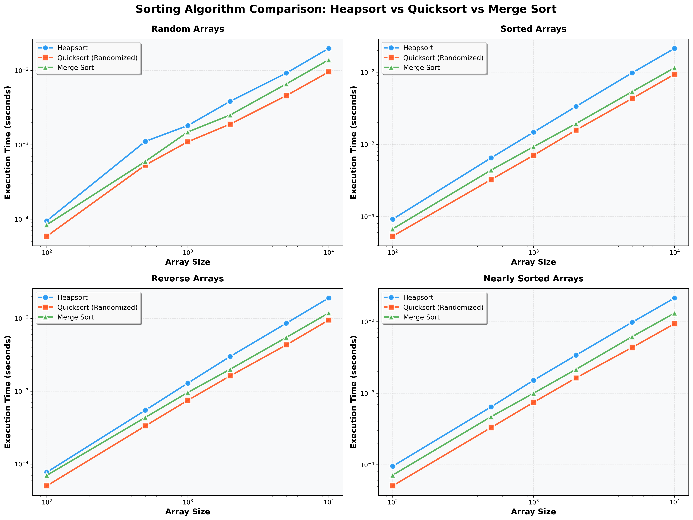

# Assignment 4 Report: Heap Data Structures - Implementation, Analysis, and Applications

## Part 1: Heapsort Implementation and Analysis

### Implementation

Let's see the main function of heapsort

```python
def heapsort(arr, left, right) -> List[int]:
   ...
   # Step 1: Build a max-heap from the unordered input
   build_max_heap(arr)

   # Step 2: Repeatedly extract the maximum and place it at the end
   for i in range(n - 1, 0, -1):
      # Move current root (maximum) to the sorted end of the array
      arr[0], arr[i] = arr[i], arr[0]
      # Step 3: Reduce the heap size and restore the heap property from root
      max_heapify(arr, i, 0)
```

And within the heapify,
```python
def max_heapify(arr, n, i) -> None:
   largest = i
   left = 2 * i + 1   # left child index
   right = 2 * i + 2  # right child index

   # Find the largest among root, left child, and right child
   if left < n and arr[left] > arr[largest]:
      largest = left
   if right < n and arr[right] > arr[largest]:
      largest = right

   # If root is not the largest, swap and recurse downward
   if largest != i:
      arr[i], arr[largest] = arr[largest], arr[i]
      max_heapify(arr, n, largest)
```

### Theoretical Analysis

#### Time Complexity: O(n log n) in All Cases

**Building the max-heap: O(n)**

Even though we call `max_heapify` for every non-leaf node, most nodes are near the bottom of the tree and have very little work to do. The summation over all levels works out to O(n) total — not O(n log n) as one might first guess.

**Extraction phase: O(n log n)**

After building the heap, we extract the maximum n−1 times. Each extraction swaps the root to the end and calls `max_heapify` from the root, which takes O(log n) since the heap height is log n. So:

```
Total = O(n)       [build heap]
      + O(n log n) [n-1 extractions × O(log n) each]
      = O(n log n)
```

**Why all three cases are the same:**

Unlike Quicksort, Heapsort doesn't have a lucky or unlucky pivot. The structure of the algorithm is always the same — build the heap, extract the max — regardless of how the input is arranged. This guarantees O(n log n) even on sorted or reverse-sorted input.

#### Space Complexity: O(1) Auxiliary

Heapsort sorts the array in-place. The only extra memory used is for a handful of index variables during swaps. The recursive `max_heapify` uses O(log n) call stack space, but that can be made iterative for strict O(1).

### Empirical Comparison

#### Test Methodology:
- Array sizes: 100, 500, 1000, 2000, 5000, 10000
- Four data distributions:
  - **Random**: Uniformly distributed random integers
  - **Sorted**: Already sorted in ascending order
  - **Reverse**: Sorted in descending order
  - **Nearly Sorted**: Mostly sorted with a few swaps
- Each test averaged over 5 trials
- Comparison between Heapsort, Randomized Quicksort, and Merge Sort

#### Results:

We could see from the picture that Heapsort has the most consistent performance across all distributions, since its structure never changes based on input. Quicksort tends to be faster in practice on random data because it has better cache locality during partitioning. Merge Sort has stable performance but requires O(n) extra memory for the auxiliary arrays, which adds overhead.

---

## Part 2: Priority Queue Implementation and Applications

### Implementation

The Priority Queue is built on a **min-heap** stored as a Python list. The key insight is that parent-child relationships can be computed arithmetically, so no pointers are needed.

```python
def insert(self, task: Task) -> None:
   # Append the new task to the end of the heap
   self._heap.append(task)
   idx = len(self._heap) - 1
   # Register the index so we can find this task later in O(1)
   self._index_map[task.task_id] = idx
   # Bubble the task up until the min-heap property is restored
   self._sift_up(idx)
```

And within the extraction,
```python
def extract_min(self) -> Task:
   # Swap the root (minimum) with the last element
   self._swap(0, len(self._heap) - 1)
   # Remove the minimum from the end
   min_task = self._heap.pop()
   del self._index_map[min_task.task_id]
   # Restore the heap property by sifting the new root downward
   if not self.is_empty():
      self._sift_down(0)
   return min_task
```

### Theoretical Analysis

#### Why Array-Based Min-Heap?

Since parent and child positions are computed as `parent(i) = (i-1)//2`, `left(i) = 2i+1`, `right(i) = 2i+2`, we avoid the pointer overhead of a linked tree. The array is also cache-friendly because all elements are stored contiguously in memory.

We chose a **min-heap** (lowest priority value = highest urgency), which mirrors how operating systems and hospital triage systems work — priority 1 is more urgent than priority 10.

#### Expected Time Complexity:

Each operation bubbles an element either up or down the tree. Since the tree height is log n, every key operation stays within O(log n):

| Operation | Time Complexity | Description |
|---|---|---|
| `insert(task)` | O(log n) | Append to end, sift up to restore heap property |
| `extract_min()` | O(log n) | Swap root to end, remove, sift down from root |
| `decrease_key(task_id, new_priority)` | O(log n) | Look up via index map (O(1)), update, sift up |
| `increase_key(task_id, new_priority)` | O(log n) | Look up via index map (O(1)), update, sift down |
| `peek()` | O(1) | Return root element without removal |
| `is_empty()` | O(1) | Check if the array length is zero |

#### Index Map Optimization

Without any extra structure, finding a specific task in the heap takes O(n). By maintaining a dictionary `{task_id → heap_index}` that is updated on every swap, we can locate any task in O(1). This makes `decrease_key` and `increase_key` O(log n) overall instead of O(n).

```python
def _swap(self, i: int, j: int) -> None:
   # Keep the index map consistent every time two elements move
   self._index_map[self._heap[i].task_id] = j
   self._index_map[self._heap[j].task_id] = i
   self._heap[i], self._heap[j] = self._heap[j], self._heap[i]
```

### Scheduler Simulation

The `scheduler_simulation()` function in `priority_queue.py` demonstrates a real-world use case:

1. Five tasks arrive with different priorities and deadlines.
2. All tasks are inserted into the priority queue.
3. A priority change occurs mid-execution (simulating an urgent event like Task 4 escalating from priority 4 to priority 1).
4. Tasks are then processed in priority order using `extract_min()`.

This models how an OS task scheduler or a hospital emergency room triage system would use a priority queue to always handle the most urgent item next, no matter when it arrived or what changes occur in between.

---

## Conclusions

As we explored in the sorting comparison, Heapsort's biggest advantage is its predictability. While Randomized Quicksort is faster on average due to better cache behavior, Heapsort guarantees O(n log n) regardless of input distribution. This makes it the right choice when worst-case performance cannot be compromised.

For dynamic workloads where items arrive and depart continuously — like task scheduling — a heap-backed priority queue is the natural fit. With O(log n) insert and extract and O(1) lookup via the index map, it handles changing priorities efficiently. Keeping the load balanced and the heap well-maintained ensures the queue stays responsive even as the workload scales.

---

## References

1. Cormen, T. H., Leiserson, C. E., Rivest, R. L., & Stein, C. (2009). *Introduction to Algorithms* (3rd ed.). MIT Press.
2. Sedgewick, R., & Wayne, K. (2011). *Algorithms* (4th ed.). Addison-Wesley.
3. Knuth, D. E. (1998). *The Art of Computer Programming, Volume 3: Sorting and Searching* (2nd ed.). Addison-Wesley.
