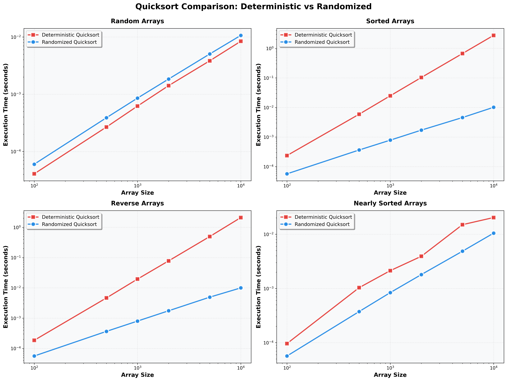

# Assignment 5 Report: Quicksort Algorithm - Implementation, Analysis, and Randomization

## Part 1: Implementation
Before diving into the analysis, we should see the steps of Quicksort first. 
First step of it is find a pivot and partition the array.

### Partition

```python
def partition(arr, left, right) -> int:
    pivot = arr[right]   # last element is the pivot
    i = left - 1         # boundary of the "≤ pivot" region

    for j in range(left, right):
        if arr[j] <= pivot:
            i += 1
            arr[i], arr[j] = arr[j], arr[i]

    # Place pivot at its correct sorted position
    arr[i + 1], arr[right] = arr[right], arr[i + 1]
    return i + 1
```

After `partition` returns, every element to the left of the returned index is less than `pivot`. And every element to the right is larger than `pivot`.

### Recursive Part
After partition the array, we could do quick sort to the left part of the pivot and right part of the pivot.

```python
def quicksort(arr, left, right) -> List[int]:
    if left < right:
        pivot_index = partition(arr, left, right)
        quicksort(arr, left, pivot_index - 1)   # left part of the pivot
        quicksort(arr, pivot_index + 1, right)  # right part of the pivot
    return arr
```

---

## Part 2: Performance Analysis

### Time Complexity

#### Best Case — O(n log n)

The best case occurs when every partition splits the array into two equal halves. Each level of the recursion tree then does O(n) total work (scanning all elements to partition them), and the tree has height log₂ n, giving:

```

            n               Level 0: n work
         /     \
        /       \
      n/2       n/2         Level 1: n/2 + n/2 = n work
     / \        / \
    /   \      /   \
  n/4   n/4  n/4   n/4      Level 2: 4(n/4) = n work
        . . . .             ...continuing...
1 1  1 1  1 1  1 1  1 1     Level log n: n(1) = n work

Height of tree: log₂(n)
Work at each level: n
Total work: n · log₂(n) = Θ(n log n)
```

This happens only when the chosen pivot is the median element of the subarray.

#### Average Case — O(n log n)

For random input, any element is equally likely to become the pivot. Even when the split is not perfectly even, an expected-case analysis shows the recursion tree still has O(log n) expected depth. The key recurrence for a uniformly random pivot is:

```
T(n) = (1/n) * Σ[k=0 to n-1] (T(k) + T(n-1-k)) + O(n)
```

Solving this recurrence (via substitution or the Akra-Bazzi method) yields:

```
E[T(n)] = O(n log n)
```

Intuitively, even a 90/10 split — far from perfect — only increases the depth to log₁₀/₉ n, which is still O(log n). The average case therefore matches the best case in asymptotic terms.

#### Worst Case — O(n²)

Assume that every partition produces the most unbalanced split, one subarray is size 0 and the other is size n-1. The depth of recurssive tree the total elements of the array, which is n. Time complextity become O(n) * O(n), and it happens when the input is already sorted.

```
T(n) = T(0) + T(n-1) + O(n)
     = T(n-1) + O(n)
     = O(n²)
```

The recursion tree degenerates into a linear chain of n levels, each doing O(n) work.

**Summary table:**

| Case | Condition | Time Complexity |
|---|---|---|
| Best | Pivot always splits array evenly | O(n log n) |
| Average | Uniformly random input | O(n log n) |
| Worst | Already sorted or reverse-sorted input with fixed pivot | O(n²) |

### Space Complexity

Quicksort sorts in-place (no auxiliary array), but the recursive call stack uses memory proportional to the recursion depth:

| Scenario | Call Stack Depth | Space Complexity |
|---|---|---|
| Best / average case | O(log n) | O(log n) |
| Worst case | O(n) | O(n) |

The in-place partitioning is a significant advantage over Merge Sort, which requires O(n) auxiliary space for the merged subarrays. However, the O(n) worst-case stack depth can cause a stack overflow if it is not optimized.

---

## Part 3: Randomized Quicksort

### How Randomization Helps

With the deterministic (last-element) pivot, an adversary who knows the algorithm can construct an input — e.g., an already-sorted array — that forces O(n²) behaviour on every run. Randomized Quicksort removes this vulnerability:

1. **No adversarial input exists.** Because the pivot is chosen uniformly at random, the algorithm's behaviour depends on random coin flips made at runtime, not on the input order. No fixed permutation can reliably trigger the worst case.

2. **Expected O(n log n) for all inputs.** Regardless of the input distribution — random, sorted, reverse-sorted, or nearly sorted — the *expected* running time is O(n log n). The expectation is taken over the algorithm's own random choices, not over any assumption about the input.

3. **Worst-case probability is negligible.** A quadratic run requires the pivot to be the minimum or maximum at every level. For an array of size n, the probability of this happening all the way down is (2/n)^(n−1), which shrinks faster than exponentially. In practice, deep imbalances are extremely rare.

### Expected Comparisons Analysis

A precise counting argument shows that the expected total number of element comparisons made by Randomized Quicksort on any input of size n is:

```
E[comparisons] = 2n ln n ≈ 1.386 · n log₂ n
```

This is within a small constant factor of the information-theoretic lower bound of n log₂ n for comparison-based sorting.

---

## Part 4: Empirical Analysis

### Test Methodology

- **Array sizes:** 100, 500, 1000, 2000, 5000, 10,000
- **Input distributions:**
  - **Random:** Uniformly distributed integers in [1, 100,000]
  - **Sorted:** Elements in ascending order (0, 1, 2, …, n−1)
  - **Reverse:** Elements in descending order (n, n−1, …, 1)
  - **Nearly Sorted:** Ascending order with ~5% of elements randomly swapped
- **Trials:** Each configuration averaged over 5 independent runs
- **Recursion limit:** Set to 100,000 to allow deterministic quicksort to run on large sorted inputs without a stack overflow

### Results



### Discussion

**Random arrays:** Both algorithms perform nearly identically. The random pivot selection in the randomized version confers no practical advantage when the input is already random, since a fixed-pivot strategy also tends to produce reasonably balanced splits on average.

**Sorted arrays:** This is where the gap is most dramatic. The deterministic version degrades to O(n²) because the last element (also the largest) is always chosen as the pivot, creating a 0 vs. n−1 split at every level. The execution time grows quadratically with array size. The randomized version, by contrast, is unaffected — a random pivot is unlikely to be the extreme element — and continues to run in near-O(n log n) time.

**Reverse-sorted arrays:** The same quadratic degradation occurs for the deterministic version. The pivot is always the minimum element of the subarray, again producing the worst-case imbalance. The randomized version again maintains O(n log n) performance.

**Nearly sorted arrays:** The deterministic version slows noticeably compared to random data because the last element is still often the largest in a nearly ordered subarray, producing mildly imbalanced splits. The randomized version handles this distribution as efficiently as random data.

These empirical results align precisely with the theoretical analysis: randomization converts a worst-case-vulnerable algorithm into one with guaranteed expected efficiency regardless of input structure.

---

## Conclusions

The deterministic Quicksort is simple and fast in practice on random data, but its reliance on a fixed pivot strategy leaves it exposed to O(n²) behaviour on sorted or adversarially constructed inputs. Adding a single line of randomization — choosing the pivot uniformly at random — eliminates this vulnerability at zero asymptotic cost. Both algorithms share the same O(n log n) average-case performance and O(1) auxiliary space (excluding the call stack), but Randomized Quicksort achieves expected O(n log n) on *all* inputs, not just random ones. For any production setting where the input distribution is unknown or potentially hostile, the randomized variant is strictly preferable.

---

## References

1. Cormen, T. H., Leiserson, C. E., Rivest, R. L., & Stein, C. (2009). *Introduction to Algorithms* (3rd ed.). MIT Press.
2. Sedgewick, R., & Wayne, K. (2011). *Algorithms* (4th ed.). Addison-Wesley.
3. Knuth, D. E. (1998). *The Art of Computer Programming, Volume 3: Sorting and Searching* (2nd ed.). Addison-Wesley.
