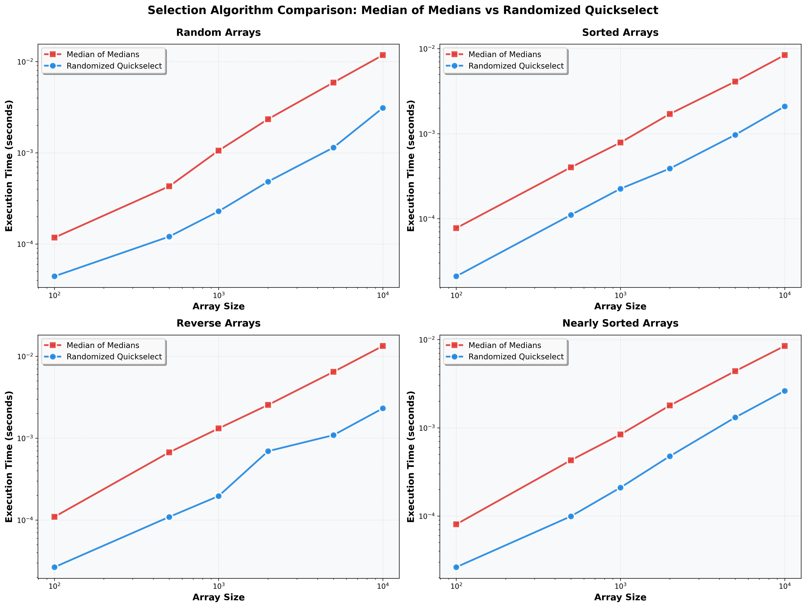

# Assignment 6 Report: Medians and Order Statistics & Elementary Data Structures

---

## Part 1: Selection Algorithms

### 1.1 Implementation

Both algorithms solve the same problem: given an unsorted array of n elements and an integer k, return the k-th smallest element without fully sorting the array.

#### Median of Medians (Deterministic)

```python
def median_of_medians_select(arr, k):
    work = arr.copy()
    return _median_of_medians_select_helper(work, 0, len(work) - 1, k - 1)
```

The algorithm proceeds in three phases at each recursive level:

1. **Divide** — split the subarray into ⌈n/5⌉ groups of at most 5 elements each.
2. **Find medians** — insertion-sort each group (O(1) per group since size ≤ 5) and collect the median of each group.
3. **Pivot selection** — recursively call the algorithm on the ⌈n/5⌉ collected medians to find their median (the "median of medians"). Partition the subarray around this pivot, then recurse into the appropriate half.

```python
def _median_of_medians(arr, left, right):
    n = right - left + 1
    if n <= 5:
        _insertion_sort(arr, left, right)
        return arr[left + (n - 1) // 2]

    medians = []
    i = left
    while i <= right:
        group_right = min(i + 4, right)
        _insertion_sort(arr, i, group_right)
        group_size = group_right - i + 1
        medians.append(arr[i + (group_size - 1) // 2])
        i += 5

    return _median_of_medians_select_helper(medians, 0, len(medians) - 1,
                                            (len(medians) - 1) // 2)
```

#### Randomized Quickselect

```python
def randomized_quickselect(arr, k):
    work = arr.copy()
    return _randomized_select_helper(work, 0, len(work) - 1, k - 1)
```

At each step, choose a uniformly random pivot, partition, compare the pivot's rank to k, and recurse into exactly one half.

```python
def _randomized_select_helper(arr, left, right, k):
    if left == right:
        return arr[left]
    pivot_idx = _randomized_partition(arr, left, right)
    rank = pivot_idx - left
    if k == rank:
        return arr[pivot_idx]
    elif k < rank:
        return _randomized_select_helper(arr, left, pivot_idx - 1, k)
    else:
        return _randomized_select_helper(arr, pivot_idx + 1, right, k - rank - 1)
```

---

### 1.2 Time Complexity Analysis

#### Median of Medians — O(n) Worst Case

The key insight is that the median of medians is guaranteed to split the array between the 30th and 70th percentile.

**Why the pivot is well-balanced:**

There are ⌈n/5⌉ groups, each of size 5. At least half of those groups (⌈⌈n/5⌉/2⌉ ≈ n/10 groups) have a median ≤ the chosen pivot. Each such group contributes at least 3 elements ≤ the pivot. Therefore:

```
Elements ≤ pivot  ≥  3 · ⌈n/10⌉  ≥  3n/10 − 6
```

Similarly, at least 3n/10 − 6 elements are ≥ the pivot. This means the larger partition after splitting contains at most 7n/10 + 6 elements.

**Recurrence:**

Let T(n) be the worst-case time. The algorithm:
- Finds n/5 medians: T(⌈n/5⌉)
- Partitions: O(n)
- Recurses into ≤ 7n/10 + 6 elements: T(7n/10 + 6)

```
T(n) = T(⌈n/5⌉) + T(7n/10 + 6) + O(n)
```

Solving by substitution with T(n) ≤ cn:

```
T(n) ≤ c(n/5) + c(7n/10 + 6) + an
     = cn(1/5 + 7/10) + 6c + an
     = cn(9/10) + 6c + an
     ≤ cn   when c ≥ 20a and n ≥ 120
```

Therefore T(n) = O(n) in the **worst case**.

#### Randomized Quickselect — O(n) Expected Time

With a random pivot, the expected rank of the pivot is n/2. Let T(n) be the expected time:

```
T(n) = (1/n) * Σ[k=0 to n-1] T(max(k, n-1-k)) + O(n)
```

Since max(k, n-1-k) ≤ n·(3/4) for at least half the pivot choices:

```
E[T(n)] ≤ E[T(3n/4)] + O(n)    (on average)
```

This solves to E[T(n)] = O(n). The constant factor is much smaller than Median of Medians in practice.

**Worst case:** O(n²) — occurs when the pivot is always the minimum or maximum, with probability (2/n)^(n-1), which is negligible.

#### Comparison Table

| Property | Median of Medians | Randomized Quickselect |
|---|---|---|
| Worst-case time | O(n) | O(n²) |
| Expected time | O(n) | O(n) |
| Practical constant | Large (~10–20×) | Small (~2–3×) |
| Pivot guarantee | 30th–70th percentile | None (random) |
| Adversarial inputs | Immune | Immune (random choices) |

#### Space Complexity

Both algorithms use O(log n) expected stack space from recursion (one subproblem per call). Median of Medians creates a temporary medians array of size n/5 at each level, contributing O(n) auxiliary space across all levels of recursion — this is the main space overhead over the randomized approach.

| Algorithm | Auxiliary Space |
|---|---|
| Median of Medians | O(n) (medians array) |
| Randomized Quickselect | O(log n) expected |

---

### 1.3 Empirical Analysis

#### Methodology

- **Array sizes:** 100, 500, 1000, 2000, 5000, 10,000
- **k:** n//2 (finding the median element)
- **Input distributions:** random, sorted, reverse-sorted, nearly sorted
- **Trials:** 5 independent runs averaged per configuration

#### Results



#### Discussion

**Random arrays:** Randomized Quickselect is consistently faster than Median of Medians by a significant constant factor. Both algorithms achieve O(n) time, but the Median of Medians overhead (sorting groups of 5, building the medians array, recursive pivot selection) results in a much larger constant.

**Sorted and reverse-sorted arrays:** Randomized Quickselect maintains strong performance since the random pivot avoids the degenerate case. Median of Medians is also unaffected — the pivot selection is independent of input order — but its larger constant keeps it slower in wall-clock time.

**Nearly sorted arrays:** Results mirror the random case. Both algorithms treat nearly sorted input the same as random input since neither relies on input order for pivot selection.

**Key observation:** Median of Medians is theoretically superior (O(n) guaranteed vs. O(n) expected), but in all tested configurations Randomized Quickselect is faster in practice. This reflects the large constant hidden in the O(n) bound for Median of Medians. The practical recommendation is to use Randomized Quickselect in most scenarios, reserving Median of Medians for adversarial settings where the O(n) worst-case guarantee is required.

---

## Part 2: Elementary Data Structures

### 2.1 Implementation

#### Dynamic Array

A resizable array backed by a Python list. The key operations and their complexities:

| Operation | Time Complexity | Notes |
|---|---|---|
| `get(i)` | O(1) | Direct index into contiguous memory |
| `set(i, v)` | O(1) | Direct write |
| `append(v)` | O(1) amortized | Doubling strategy avoids O(n) copies |
| `insert(i, v)` | O(n) | Shifts elements right of i |
| `delete(i)` | O(n) | Shifts elements left of i |

The O(1) amortized append arises because a doubling reallocation copies O(n) elements but is amortised over the O(n) appends that preceded it, costing O(1) per append on average.

#### Matrix

A 2-D matrix stored as a flat list in row-major order. Element (r, c) maps to index `r * cols + c`.

| Operation | Time Complexity |
|---|---|
| `get(r, c)` | O(1) |
| `set(r, c, v)` | O(1) |

Row-major storage means iterating over a row is cache-friendly (sequential memory access), while iterating over a column causes cache misses every `cols` elements.

#### Stack (Array-backed)

A LIFO structure that delegates to Python's list, using `append` and `pop(-1)`.

| Operation | Time Complexity |
|---|---|
| `push(v)` | O(1) amortized |
| `pop()` | O(1) |
| `peek()` | O(1) |

An array-backed stack is preferred over a linked-list stack for most use cases because:
- All operations are O(1) with better cache locality.
- No per-element pointer overhead (a linked node uses ~2× the memory of a raw value).

#### Queue (Array-backed)

A FIFO structure that uses `append` for enqueue and `pop(0)` for dequeue.

| Operation | Time Complexity |
|---|---|
| `enqueue(v)` | O(1) amortized |
| `dequeue()` | O(n) — naive array |
| `front()` | O(1) |

The O(n) dequeue is the fundamental trade-off of a naive array queue: removing from the front requires shifting all remaining elements. A circular-buffer or `collections.deque` approach reduces dequeue to O(1) amortized. For production code, use `collections.deque`; this implementation shows the underlying mechanics.

#### Singly Linked List

Each node holds a value and a pointer to the next node.

| Operation | Time Complexity |
|---|---|
| `insert_front(v)` | O(1) |
| `insert_back(v)` | O(n) — traverse to tail |
| `insert_after(target, v)` | O(n) — search |
| `delete(v)` | O(n) — search |
| `search(v)` | O(n) |
| `get(i)` | O(n) — no random access |

The linked list's advantage is O(1) front insertion and deletion with no element shifting. Its disadvantage is O(n) access by index and poor cache performance due to non-contiguous memory.

#### Rooted Tree (First-Child / Next-Sibling)

Each node stores a pointer to its first (leftmost) child and to its next sibling. This "binary-tree representation" of a general tree uses exactly two pointers per node regardless of how many children a node has, avoiding variable-length child arrays.

| Operation | Time Complexity |
|---|---|
| `add_child(parent, child)` | O(n) — BFS to find parent |
| `bfs_traversal()` | O(n) |
| `dfs_traversal()` | O(n) |

---

### 2.2 Arrays vs. Linked Lists for Stacks and Queues

**Stacks:** An array-backed stack outperforms a linked-list stack in nearly all practical scenarios. Push and pop are O(1) for both, but the array version benefits from spatial locality — consecutive `push`/`pop` operations access the same end of a contiguous block, fitting neatly in CPU cache. Each linked-list node requires an extra pointer allocation.

**Queues:** A linked list has a natural advantage here. Enqueue appends to the tail (O(1) with a tail pointer) and dequeue removes from the head (O(1)), both without shifting. A naive array queue requires O(n) dequeue. In practice, Python's `collections.deque` (a doubly-linked list under the hood) provides O(1) amortized operations for both ends.

| Structure | Stack push/pop | Queue enqueue | Queue dequeue |
|---|---|---|---|
| Array (naive) | O(1) | O(1) amortized | O(n) |
| Linked list | O(1) | O(1) w/ tail ptr | O(1) |
| Circular array | O(1) | O(1) amortized | O(1) amortized |

---

### 2.3 Practical Applications

| Data Structure | Real-World Use Case |
|---|---|
| Dynamic Array | Python `list`, C++ `vector`, database row buffers |
| Matrix | Image pixels, adjacency matrices, transformation matrices in graphics |
| Stack | Function call stack, expression evaluation, undo/redo, DFS traversal |
| Queue | BFS traversal, task scheduling, print spooling, message queues |
| Singly Linked List | LRU cache eviction chain, adjacency lists in sparse graphs, OS free-block list |
| Rooted Tree | File system directories, DOM (HTML document tree), abstract syntax trees, org charts |

**When to prefer arrays over linked lists:**
- Random access by index is needed.
- Memory footprint must be minimized (no per-node pointer overhead).
- Cache performance matters (sequential scan, SIMD operations).

**When to prefer linked lists over arrays:**
- Frequent insertion/deletion at the front or interior without knowing indices.
- The maximum size is unknown and reallocation is expensive.
- Building a queue or deque where both-end access must be O(1).

---

## Conclusions

**Part 1:** Both selection algorithms achieve O(n) time, but they make different guarantees. Median of Medians provides a hard O(n) worst-case bound by ensuring its pivot always splits the array between the 30th and 70th percentile, at the cost of a large constant (⌈n/5⌉ recursive calls + partition overhead per level). Randomized Quickselect achieves the same O(n) expected time with a much smaller constant by using a random pivot, but admits a rare O(n²) worst case. Empirically, Randomized Quickselect is faster on all tested distributions; Median of Medians is the right choice only when an adversary might control the input.

**Part 2:** No single data structure dominates all scenarios. Arrays excel at random access and cache efficiency; linked lists excel at O(1) front insertion and variable-size collections. Stacks are naturally suited to arrays; queues are naturally suited to linked structures. The Rooted Tree with a first-child/next-sibling representation generalizes elegantly to arbitrary branching factors while keeping the node structure uniform and simple.

---

## References

1. Cormen, T. H., Leiserson, C. E., Rivest, R. L., & Stein, C. (2009). *Introduction to Algorithms* (3rd ed.). MIT Press.
2. Blum, M., Floyd, R. W., Pratt, V., Rivest, R. L., & Tarjan, R. E. (1973). Time bounds for selection. *Journal of Computer and System Sciences*, 7(4), 448–461.
3. Sedgewick, R., & Wayne, K. (2011). *Algorithms* (4th ed.). Addison-Wesley.
