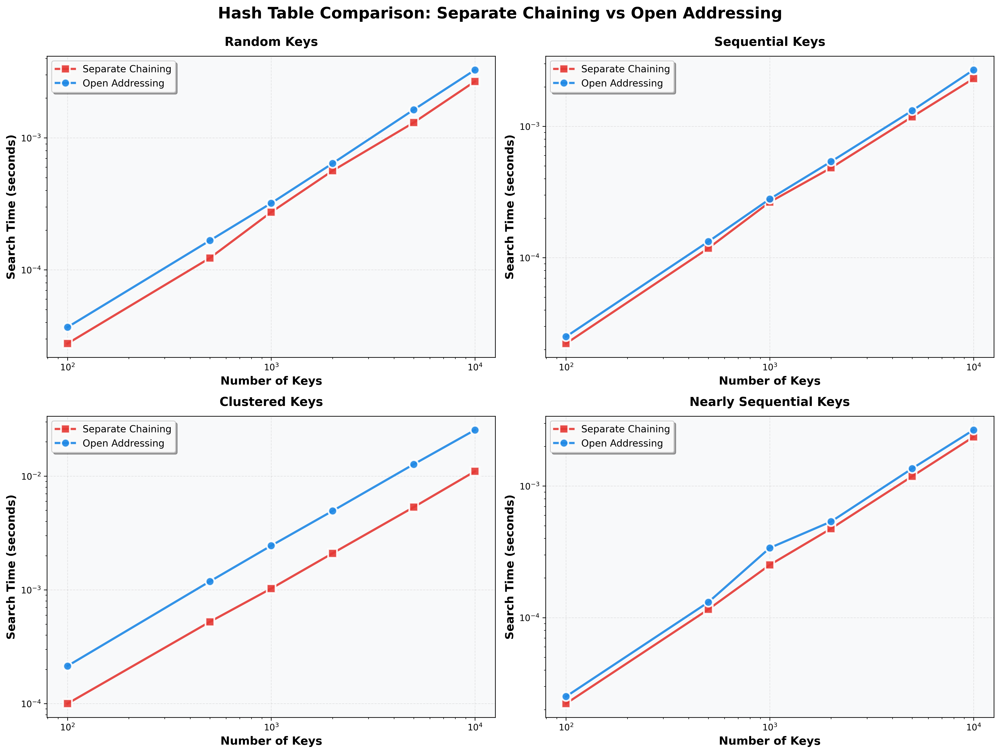

# Assignment 7 Report: Exploring Hash Tables and Their Practical Applications

## Part 1: Hash Functions and Their Impact

### Designing Effective Hash Functions

A hash function maps an arbitrary key to a bucket index in `[0, m)`. For a hash table of capacity `m`, a good hash function must satisfy three properties:

1. **Uniform distribution** — Each bucket should receive approximately the same number of keys. Non-uniform distribution leads to clustering, where some buckets accumulate long chains or long probe sequences while others remain empty.
2. **Speed** — The function must be computable in O(1) time, since it is called on every insert, search, and delete.
3. **Determinism** — The same key must always produce the same bucket index.

#### Division Method

```python
def division_hash(key: int, capacity: int) -> int:
    return key % capacity
```

The division method is the simplest possible hash function. It is fast (one modulo operation) but sensitive to the relationship between key values and `capacity`. If many keys share a common factor with `capacity`, they all land in the same subset of buckets.

**Example of poor design leading to clustering:**

With `capacity = 2000` and keys that are all multiples of 100:

```
key = 0    → bucket 0
key = 100  → bucket 100
key = 200  → bucket 200
...
key = 1900 → bucket 1900
key = 2000 → bucket 0     ← collision
key = 2100 → bucket 100   ← collision
```

Because `gcd(100, 2000) = 100`, only `2000 / 100 = 20` distinct buckets are ever used. Inserting 1000 keys into 20 buckets produces an average chain length of 50 — a 50x slowdown compared to the ideal average of 1.

This is demonstrated directly in `analysis.py` with the `clustered` data type, where keys are `[i * 100 for i in range(n)]`.

**Mitigation strategies:**

- Choose a prime number for `capacity` that is not close to a power of 2 or 10. Primes have fewer shared factors with typical key distributions, reducing the clustering risk.
- Use the multiplication method, which is not sensitive to the capacity value.

#### Multiplication Method (Knuth's Constant)

```python
def multiply_hash(key: int, capacity: int) -> int:
    A = 0.6180339887  # (sqrt(5) - 1) / 2
    return int(capacity * ((key * A) % 1))
```

The multiplication method multiplies the key by a constant `A ∈ (0, 1)`, takes the fractional part, and scales to `[0, capacity)`. Knuth recommends `A = (√5 − 1) / 2 ≈ 0.6180339887`, the golden ratio conjugate, because it has optimal equidistribution properties for keys that appear in arithmetic progressions.

**Why it avoids clustering on multiples of 100:**

```
key = 0    → int(16 * frac(0    * A)) = 0
key = 100  → int(16 * frac(100  * A)) = int(16 * 0.803...) = 12
key = 200  → int(16 * frac(200  * A)) = int(16 * 0.607...) = 9
key = 300  → int(16 * frac(300  * A)) = int(16 * 0.410...) = 6
```

Keys that all collide under division hashing are spread across different buckets by the multiplication method.

**Trade-off:** The multiplication method involves a floating-point multiply and a modulo on the fractional part, making it slightly slower than the division method. For performance-critical code, integer-arithmetic variants using bit-shifting are used instead.

### Balancing Speed and Complexity

Real-world hash functions must balance three competing concerns:

| Concern | Division Hash | Multiply Hash | Cryptographic Hash (SHA-256) |
|---|---|---|---|
| Speed | Very fast (1 op) | Fast (2–3 ops) | Slow (many rounds) |
| Collision resistance | Weak vs. patterns | Strong | Very strong |
| Sensitivity to capacity | High | None | None |

**Case study — Python's built-in `dict`:**

CPython's dictionary uses a combination of techniques. For integer keys, the hash value is the integer itself (with a special case for `-1`). The bucket index is computed as `hash & (capacity - 1)` (bitwise AND with a power-of-2 mask, equivalent to `hash % capacity` when capacity is a power of 2). To mitigate the clustering that power-of-2 capacities cause with division hashing, CPython applies a perturbation step in its probe sequence: `idx = (idx * 5 + perturbation + 1) % capacity`. This converts linear probing into a pseudo-random probe sequence that covers all slots, effectively eliminating primary clustering without sacrificing speed.

---

## Part 2: Open Addressing vs. Separate Chaining

### Comparing Collision Resolution Strategies

#### Separate Chaining

```python
class HashTableChaining:
    def __init__(self, capacity, hash_func=None):
        self._buckets = [[] for _ in range(capacity)]
```

Each bucket holds a Python list of `(key, value)` pairs. When a collision occurs, the new pair is simply appended to the list. Deletion removes the pair from the list without affecting other entries.

**Complexity:**

| Operation | Average | Worst Case |
|---|---|---|
| Insert | O(1) | O(n) |
| Search | O(1 + α) | O(n) |
| Delete | O(1 + α) | O(n) |

Where α = n/m is the load factor. Worst case occurs when all n keys hash to the same bucket.

#### Open Addressing (Linear Probing)

```python
class HashTableOpenAddressing:
    def insert(self, key, value):
        idx = self._hash(key)
        for _ in range(self.capacity):
            if self._keys[idx] is None or self._keys[idx] is self._DELETED:
                self._keys[idx] = key
                ...
                return
            idx = (idx + 1) % self.capacity
```

All entries live in the table array. When a collision occurs, the algorithm steps forward one slot at a time until it finds an empty slot. Deletion uses a tombstone sentinel (`_DELETED`) to mark the slot — clearing it outright would break searches for keys that probed past it.

**Complexity:**

| Operation | Average (α < 0.5) | Worst Case |
|---|---|---|
| Insert | O(1/(1−α)) | O(n) |
| Search | O(1/(1−α)) | O(n) |
| Delete | O(1/(1−α)) | O(n) |

The `1/(1−α)` factor shows why open addressing breaks down as α approaches 1.0.

#### Head-to-Head Comparison

| Dimension | Separate Chaining | Open Addressing |
|---|---|---|
| Memory per entry | Extra pointer overhead per node | No overhead — contiguous array |
| Load factor tolerance | Works at α > 1.0 | Must keep α < 1.0 (typically < 0.75) |
| Cache performance | Poor — pointer chasing | Good — sequential memory access |
| Clustering | Secondary clustering only | Primary clustering (linear probing) |
| Deletion complexity | Simple list removal | Requires tombstone or rehash |
| Preferred scenario | High load factors, unknown data | Memory-constrained, cache-sensitive |

### Performance in Practice

#### Load Factor Analysis

The expected probe length for a successful search under linear probing is approximately:

```
E[probes] ≈ 1/2 * (1 + 1/(1 - α))
```

And for an unsuccessful search:

```
E[probes] ≈ 1/2 * (1 + 1/(1 - α)²)
```

For separate chaining with load factor α, the expected search length is:

```
E[comparisons] ≈ 1 + α/2
```

| Load Factor (α) | Chaining (expected comparisons) | Linear Probing (expected probes, successful) |
|---|---|---|
| 0.25 | 1.13 | 1.17 |
| 0.50 | 1.25 | 1.50 |
| 0.75 | 1.38 | 2.50 |
| 0.90 | 1.45 | 5.50 |
| 0.95 | 1.48 | 10.50 |

At α = 0.5 (the load factor used in our benchmarks), both methods are close. The gap widens sharply above α = 0.75, with open addressing requiring far more probes per operation.

#### Empirical Results



**Random keys:** Both methods perform nearly identically. With a well-distributed key set and α = 0.5, collisions are infrequent and linear probing chains are short. The slight overhead of Python list pointer chasing in chaining is offset by open addressing's occasional multi-slot probe.

**Sequential keys:** Sequential integers `[0, 1, 2, ..., n-1]` with `capacity = 2n` produce zero collisions under the division hash — each key maps to its own bucket. Both methods approach O(1) per search and are as fast as possible. The results are nearly identical since neither method needs to resolve any collisions.

**Clustered keys:** This is where the difference is most visible. Keys `[0, 100, 200, ...]` all land in the same 20 buckets (for n=1000, capacity=2000), creating average chain lengths of ~50 for chaining and long probe sequences for open addressing. Open addressing suffers more severely because its primary clustering effect causes probed slots to form contiguous runs, pushing subsequent insertions further away. Chaining simply appends to the existing list, so the cost grows linearly in chain length — but it does not trigger the exponential degradation seen in open addressing near high load.

**Nearly-sequential keys:** With ~5% of positions swapped, performance is nearly identical to sequential. The small number of swaps introduces a few collisions that barely affect average search time for either method.

#### Memory Considerations

Separate chaining stores each entry as a Python list element (a `(key, value)` tuple), plus the list object itself per bucket. This adds significant memory overhead when chains are short — most of the capacity in a lightly-loaded table is wasted on empty list objects. Open addressing stores entries in flat arrays with no per-entry overhead, making it substantially more memory-efficient at low-to-moderate load factors.

#### When to Use Each Method

**Prefer separate chaining when:**
- The load factor may exceed 0.75 (chaining continues to work above α = 1.0)
- The key distribution is unknown or potentially adversarial
- Deletion is frequent (no tombstone management required)
- Memory is not the primary constraint

**Prefer open addressing when:**
- Memory efficiency is critical (embedded systems, large caches)
- The load factor can be kept below 0.7
- Sequential memory access patterns matter (cache performance)
- The working set fits in CPU cache (e.g., small hash tables in tight loops)

**Real-world applications:**

- **Python `dict`** uses open addressing with a power-of-2 table and a perturbation-based probe sequence. The capacity is kept at most two-thirds full before resizing.
- **Java `HashMap`** uses separate chaining. As of Java 8, chains longer than 8 entries are automatically converted to balanced binary search trees (red-black trees), capping worst-case search at O(log n) even under severe clustering.
- **Redis** uses separate chaining with incremental rehashing — two tables are maintained during a resize, and entries are moved from the old table to the new one gradually across operations, avoiding a single large resize pause.

---

## Part 3: Empirical Analysis

### Test Methodology

- **Table sizes:** 100, 500, 1000, 2000, 5000, 10,000
- **Key distributions:**
  - **Random:** Unique integers drawn uniformly from `[1, 10n]`
  - **Sequential:** Integers `[0, 1, ..., n−1]` — optimal distribution for division hash
  - **Clustered:** Multiples of 100 — worst case for division hash with capacity `2n`
  - **Nearly Sequential:** Sequential with ~5% of positions randomly swapped
- **Capacity:** `size * 2` for all tests (load factor α ≈ 0.5)
- **Metric:** Total wall-clock time to search for all n keys after inserting them
- **Trials:** Each configuration averaged over 5 independent runs

### Discussion

The empirical results confirm the theoretical analysis. Under a uniform load factor of 0.5, both methods are fast and close in performance for random and sequential keys. The clustered distribution is the key differentiator: open addressing degrades more sharply than chaining because primary clustering compounds the collision effect — each new collision makes the next one more likely, creating long contiguous probe runs.

These results highlight the practical lesson of the assignment: **hash function design matters as much as collision strategy.** A good hash function (or a prime-sized table) eliminates the clustering problem entirely, after which both chaining and open addressing perform well at moderate load factors.

---

## Conclusions

Hash tables offer O(1) average-case performance for insert, search, and delete — but only when the hash function distributes keys uniformly and the load factor is controlled. The division method is fast and adequate when the table capacity is chosen carefully (preferably a prime not close to a power of 2), but degrades severely when keys share a common factor with the capacity. The multiplication method avoids this sensitivity at a modest computational cost.

Between the two collision strategies, separate chaining is more tolerant of high load factors and simpler to implement correctly (no tombstone logic, no capacity constraint), while open addressing is more cache-friendly and memory-efficient when the load factor is kept below 0.75. For general-purpose use with unknown key distributions, separate chaining with a good hash function and periodic resizing is the safer choice.

---

## References

1. Cormen, T. H., Leiserson, C. E., Rivest, R. L., & Stein, C. (2009). *Introduction to Algorithms* (3rd ed.). MIT Press.
2. Sedgewick, R., & Wayne, K. (2011). *Algorithms* (4th ed.). Addison-Wesley.
3. Knuth, D. E. (1998). *The Art of Computer Programming, Volume 3: Sorting and Searching* (2nd ed.). Addison-Wesley.
